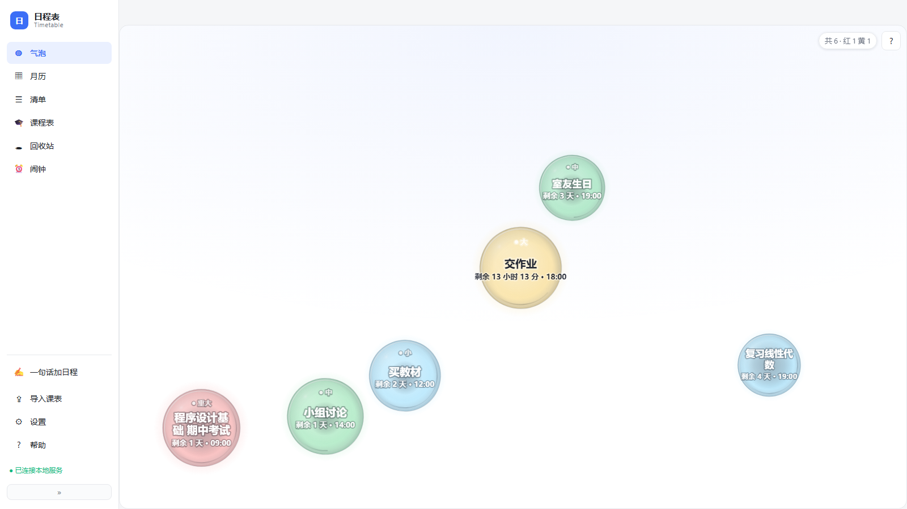
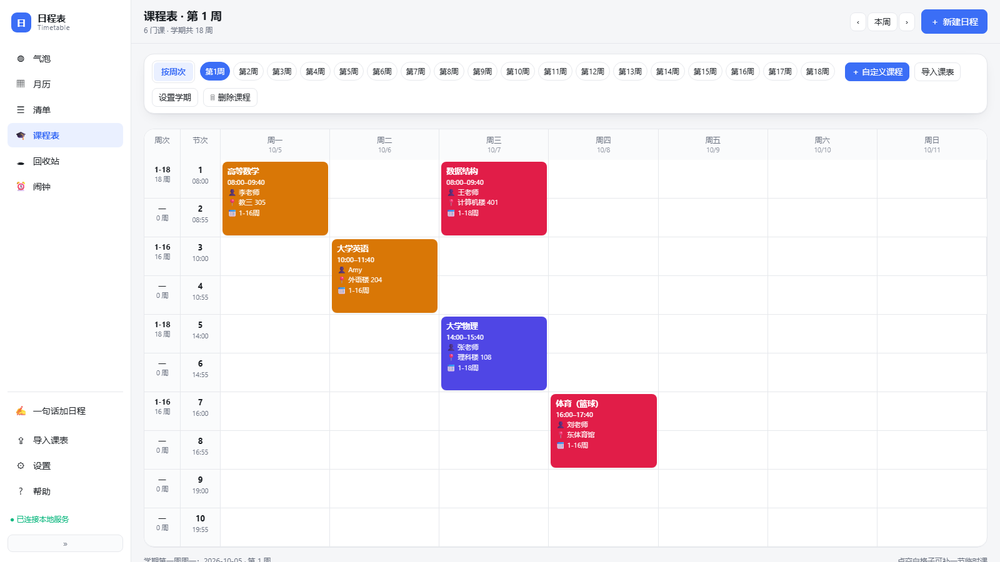
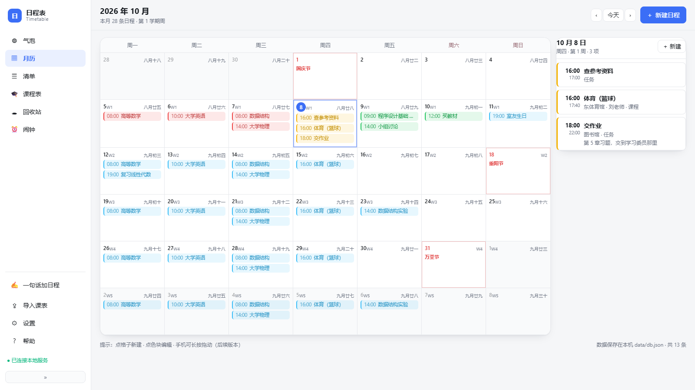
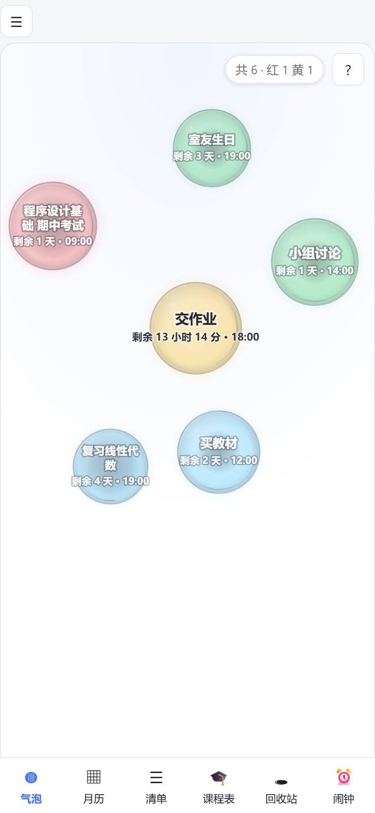
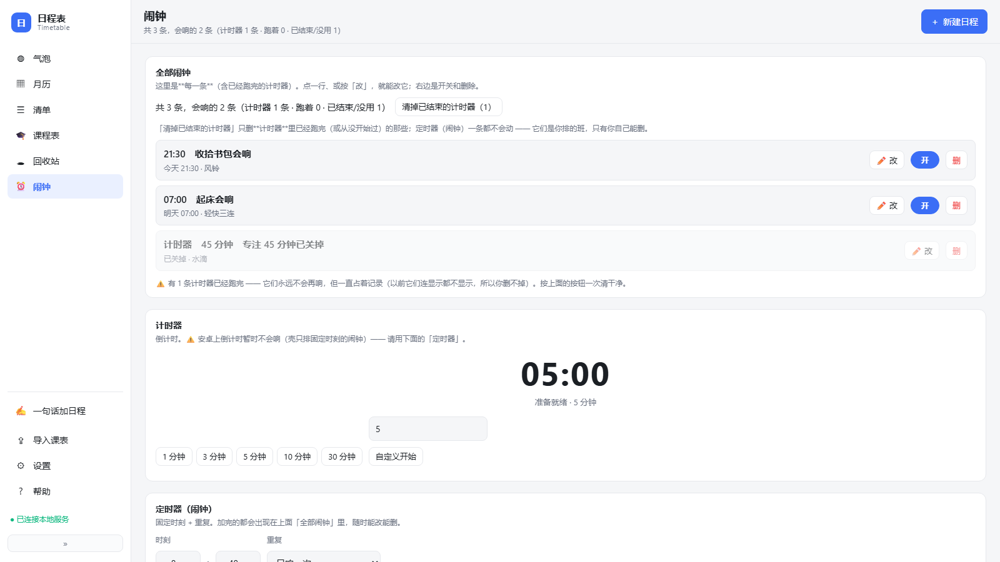

# 日程表（Timetable）

一个**本地优先**的日程 / 课程表工具：电脑上是一个网页 + 一块飘在桌面上的气泡区，手机上是一个 App（安卓 / iOS 各自是一个原生外壳，里面跑的是同一份网页与同一份核心逻辑）。

数据全部存在**你自己的设备**上 —— 不注册、不登录、不上传、没有云。

[](https://github.com/4shy4/timetable/actions/workflows/test.yml)
[](LICENSE)




**先看一眼** · 在线 demo：<https://4shy4.github.io/bubble-schedule/>（同一套界面的网页演示，浏览器直接打开，不用装任何东西；可能比最新版旧一点）
**要装到手机上** · 下载最新版：[Releases](https://github.com/4shy4/timetable/releases/latest)（安卓 APK，已用固定密钥签名，以后的版本能直接覆盖安装）

> 本仓库是从作者的**完整版**自动导出的**精简版**：去掉了未完成 / 不适合公开发布的模块（见「精简版去掉了什么」）。
> 导出脚本不在本仓库内，因此这里的文件是单向快照；精简版与完整版不保证逐行一致。

---

## 它适合谁

### 学生：把课表变成「看得见的时间」

课表是学生最刚需的一份日程，但它通常躺在教务系统里 —— 要登录、要翻页、还不好看。这个工具把课表变成一块一直看得见的东西：

- **课程表网格**：单双周、多节连堂、按周次范围（第 3–17 周的课不会在第 1 周就跳出来）
- **桌面气泡区**：今天 / 明天要上的课飘在桌面上，**大小 = 还剩多久，颜色 = 事情多大**，可拖动、可折叠、可点击展开
- **闹钟 / 提醒**：安卓走系统闹钟（`setExactAndAllowWhileIdle` + 前台服务，能穿透省电），iOS 走 AlarmKit 真闹钟（会像系统闹钟那样响）
- **不用任何校内系统**：自己手加，或者粘贴一份标准 JSON（见「怎么自己加课程表」）



### 任何人：日程不要经过别人的服务器

如果你只是想要一个「记下来、到点提醒我、数据不出我这台机器」的日程工具：

- **月历 / 列表**两个视图，支持重复日程（每天 / 每周 / 每月 / 自定义）、倒数日、标签、颜色、回收站
- **数据只在本地**：电脑上是仓库里的 `data/`，手机上是 App 的私有目录或沙盒；没有账号，没有埋点，没有服务端
- **导出与分享**：可以分享成图片或 `.ics` 日历文件塞进系统的日历 App；网页可以「添加到主屏幕」当 PWA 用（离线也能开）
- **局域网同步**：电脑上跑起来加 `--lan`，手机浏览器直接访问；安卓还有一条 USB 单向同步（电脑 → 手机）



---

## 一、电脑上跑起来

需要 **Node.js 22 或更新**（不需要 `npm install`：本项目的运行时依赖为零，`package.json` 里的依赖只有开发期工具）。

```bash
node server/main.js
```

然后打开 <http://127.0.0.1:7080>。

常用参数：

| 参数 | 作用 |
| --- | --- |
| `--lan` | 监听 `0.0.0.0`，让同一局域网的手机 / 平板能访问（会在启动日志里打印可用地址） |
| `--port=7080` | 换 HTTP 端口 |
| `--https` | 额外起一个 HTTPS 端口（默认 7443，需要 `data/cert/server.pfx`） |
| `--data-dir=D:\我的日程` | 把数据目录换到别处（默认是仓库里的 `data/`） |

也可以直接用环境变量 `TIMETABLE_DATA_DIR` 指定数据目录（优先级低于 `--data-dir=`）。

几个常用的现成命令（`package.json` 里的脚本，等价于上面的参数）：

| 命令 | 作用 |
| --- | --- |
| `npm start` | 只在本机跑（`127.0.0.1:7080`） |
| `npm run start:lan` | 同时让同一局域网的手机 / 平板能访问（会打印可用地址） |
| `npm run desktop` | 打开**桌面气泡区**（今天 / 明天的日程飘在桌面上，可拖动、可折叠） |

## 二、手机上装

### 安卓

**最快的路**：去 [Releases](https://github.com/4shy4/timetable/releases/latest) 下载 APK，拷进手机点安装（需要在系统里允许「安装未知应用」）。这个包用一把固定的密钥签名，所以**以后的版本可以直接覆盖安装**，数据也不会丢。

**自己从源码打**：外壳源码在 `android/`，构建脚本会先下载 JDK + Android SDK + Gradle（约 1.3 GB，只需要一次），再打一个 APK：

```bash
node tools/android-bootstrap.mjs        # 下载工具链（一次性）
node tools/android-bootstrap.mjs --verify
npm run android:build                   # 产物：android/app/build/outputs/apk/debug/app-debug.apk
```

装到连着的设备上：`npm run android:apk`（内部用 `adb install -r`）；也可以把打好的 `app-debug.apk` 直接拷进手机点安装（debug 签名，需要在系统里允许「安装未知应用」）。

> 想打**正式签名**的包（能一直覆盖升级）：自己生成一把 keystore，然后在 `android/app/build.gradle` 的 `signingConfigs` 里接上它；**密钥丢了就再也无法给已安装的用户推更新**，务必备份。

> `npm run android:verify`（= `android:parity` + `android:http`）要**连着一台真机**、并且机器上有 `adb` 才能跑；干净环境里这两条失败是正常的，不影响别的测试。

安卓 App 打开后会启动一个**只监听本机**的 HTTP 服务（`127.0.0.1:17800`），整个界面就是这份网页；日程数据存在 App 自己的私有目录里。

**把电脑上的日程同步到手机**（单向：电脑 → 手机，因为「删除」没法靠合并表达 —— 两边一起改会互相把删掉的东西带回来）：

```bash
npm run sync:dry     # 先看一眼会推什么，不改手机
npm run sync         # 真的推（需要：USB 连着手机、手机已允许 USB 调试、App 正在前台）
```

- 它推的是**电脑上当前**的日程与课程，会**替换**手机上的那一份；推之前会自动把手机当前的数据备份到 `build/phone-backup/`。
- 需要 `adb`：先在「安卓」那一节跑一次 `node tools/android-bootstrap.mjs`（它会把 `adb` 一起下下来），并确保电脑上的日程表正在运行。
- 推完它会自动重启手机上的 App，好让提醒 / 闹钟按新数据重排。

### iOS

`ios/` 是一个 Swift 外壳（AlarmKit + WebKit），工程定义在 `ios/project.yml`（[XcodeGen](https://github.com/yonaskolb/XcodeGen) 格式，仓库里**没有** `.xcodeproj`）：先 `cd ios && xcodegen generate` 生成工程，再用 Xcode 打开、填上你自己的签名，才能装到设备上。仓库里也**没有**预编译的 IPA。

不想折腾签名的话，最省事的路是**用 Safari 打开电脑上的地址 → 分享 → 添加到主屏幕**：它就是一个 PWA，能全屏打开、能收通知（iOS 16.4+）。

<p align="center">
  
</p>

## 三、有什么功能

- **桌面气泡区**：今天 / 明天的日程飘在桌面上，可拖动、可折叠（`web/ui/views/bubble.js`）
- **月历 / 列表 / 课程表**三个视图，支持重复日程（每天 / 每周 / 每月 / 自定义）、倒数日、标签、颜色、回收站
- **课程表**：支持单双周、多节连堂、按周次范围；可以手动增删改，也可以用 JSON 导入（见下节）
- **提醒**：浏览器 / 电脑端用系统通知；iOS 走 AlarmKit 真闹钟；安卓走系统闹钟（`setExactAndAllowWhileIdle` + 前台服务）
- **分享与 PWA**：可以把视图分享成图片 / `.ics` 日历文件；网页可以「添加到主屏幕」当 PWA 用
- **语音桥 / 提醒事项桥**：iOS 端可用 Siri 快捷指令把内容塞进来（见 `web/adapter/native.js` 的消息协议）



## 四、怎么自己加课程表

不用任何校内系统，两条路：

1. **在界面上手加**：课程表视图 → 右下角加号 → 填课名 / 星期 / 节次 / 周次。
2. **导入 JSON**：打开「导入」视图，在**「② 标准 JSON（校验与预览）」**那张卡里粘贴下面这种结构（旁边有「载入示例」「选择 JSON 文件」「下载格式模板」三个按钮）：

```json
{
  "meta": {
    "termStart": "2026-09-07",
    "termWeeks": 18,
    "sectionTimes": [
      { "index": 1, "start": "08:00", "end": "08:45" },
      { "index": 2, "start": "08:55", "end": "09:40" },
      { "index": 5, "start": "14:00", "end": "14:45" }
    ]
  },
  "courses": [
    { "title": "高等数学", "teacher": "李老师", "location": "教三 305",
      "dayOfWeek": 1, "sections": [1, 2], "weeks": [1,2,3,4,5,6,7,8,9,10,11,12,13,14,15,16] },
    { "title": "数据结构实验", "location": "机房 A",
      "dayOfWeek": 5, "sections": [5, 6], "weeks": [3,5,7,9,11,13,15,17], "tags": ["实验"] }
  ]
}
```

- **必填**：`courses[].title`、`dayOfWeek`（1=周一 … 7=周日）、`sections`（节次序号数组）、`weeks`（周次数组）。
- **可选**：`teacher`、`location`、`tags`、`color`；`meta.sectionTimes` 决定每节课的上下课时间（不写就用默认作息表）。
- 导入界面里有「载入示例」和「下载格式模板」两个按钮，可以直接拿去改。
- 界面上也能**导出**成同样的格式，用来备份或换设备。

## 五、数据与隐私

- 所有数据都在本机：电脑上是 `data/`（`db.json` / `fired.json` / `server.log`），安卓上是 App 私有目录，iOS 上是 App 沙盒。
- 没有账号、没有云同步、没有埋点。要换设备就用「备份 / 恢复」（导出 JSON）或直接拷 `data/`。
- 仓库里 `.gitignore` 已经把 `data/` 排除掉了 —— 别把自己的日程提交上去。

## 六、精简版去掉了什么

| 去掉的东西 | 为什么 |
| --- | --- |
| **AI 助手**（聊天、周报、热点话题、本地 / 远程模型接线） | 功能还在打磨，先不公开 |
| **好友祝福**（联系人、生日 / 节日批量发消息） | 同上 |
| **校内系统课程导入**（排课器 / 教务系统专用适配器） | 只对特定学校有效，属于私人适配；公开版只保留「自己手加 / 通用 JSON 导入」 |
| **两个没做完的隐藏视图**（周课表、三日） | 界面已隐藏很久，留着是无用代码 |

保留下来的都是通用的：桌面气泡、月历、列表、课程表、回收站、导入导出、提醒与闹钟、分享 / PWA、语音与提醒事项桥。

## 七、开发

```
core/     平台无关的纯逻辑（课程、重复规则、提醒、节假日、日历导出…），三端共用
server/   电脑端的 HTTP 服务 + JSON 存储 + 提醒调度
web/      界面（原生 ESM，无框架、无打包步骤）
android/  安卓外壳（Kotlin：WebView + 本地服务 + 系统闹钟）
ios/      iOS 外壳（Swift：WebView + AlarmKit）
tools/    自检与生成脚本（预缓存清单、模块完整性检查、安卓构建…）
```

跑测试（`npm test` 跑的是自写的 `node --test` 套件，纯逻辑 + 无头浏览器之外的检查，不需要真机）：

```bash
npm test
node tools/js-preflight.mjs     # 语法 / 未定义引用之类的最低门槛
node tools/core.test.mjs        # 只看核心层
```

仓库里还有两个套件要**真机 + `adb`** 才能跑，所以**没有**放进 `npm test`：`tools/android-http.test.mjs`、`tools/android-parity.test.mjs`（就是上面 `npm run android:verify` 用的那两个）。

改完 `web/` 或 `core/` 之后，如果新增 / 删除了文件，记得重跑预缓存清单（PWA 离线用）：

```bash
node tools/gen-precache.mjs --write
```

## 八、许可证

**MIT**，见 [LICENSE](LICENSE)。

意思是可以自由使用、修改、再发布（包括用在商业项目里），只要保留版权声明和这份许可证文本。软件按「现状」提供，不附带任何担保。
